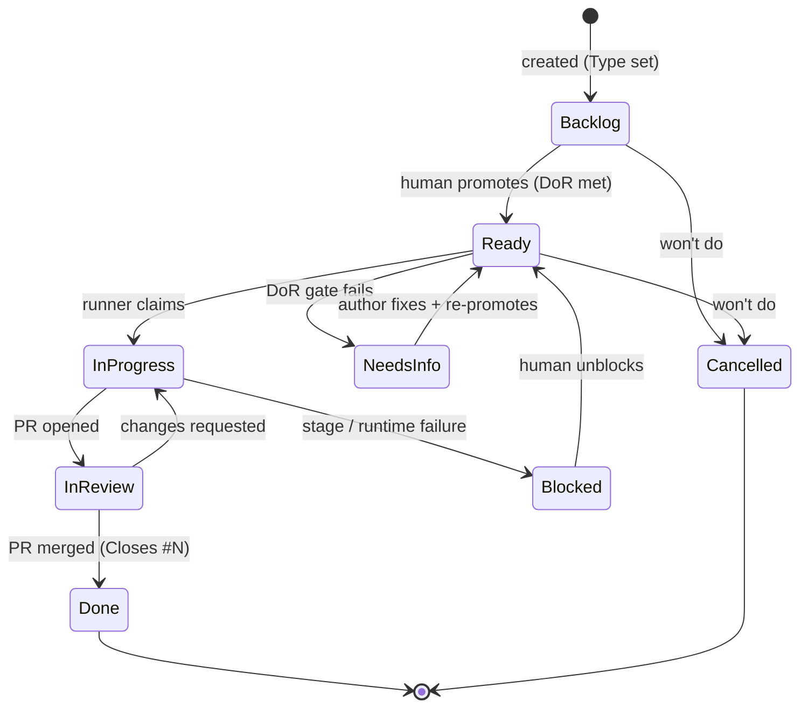

# RFC 0003 — Task state model

**Status:** Accepted — implemented (native Status/Reason fields live on Project #1) · **rev 2** (2026-06-18, native primitives) · **Amends** [0001-ticket-driven-dev-workflow](0001-ticket-driven-dev-workflow.md) · **Informs** 2026-06-17-dev-runner-v1

## Principle

Status belongs to the task — and we represent every facet with GitHub's **native** mechanism, not labels. ("Default to platform behaviour": don't build a sidecar to make labels mimic a field GitHub already has.) Rev 1 used `status:*` labels; rev 2 corrects that to native fields/types after Jose's review.

## Decision

| facet | native mechanism | replaces (rev 1) |
|---|---|---|
| **Type** (Task / Bug / Feature) | **Issue Type** — `gh issue create --type Task` | `task` label |
| **Hierarchy** (epic) | **sub-issues** — `gh issue create --parent N` | `epic` label |
| **Status** (lifecycle) | **Projects Status field** (single-select) | `status:*` labels |
| **done / cancelled** | native **close** (+reason); Projects auto-sets Status = Done on close | `done` label, the backstop |
| **size / priority** | **Projects custom fields** (typed) | `complex` label, size text |

Labels drop to ~zero (only genuine free-form tags, if any).

## Lifecycle

- Status options live on the **Projects Status field**. `Done` is set by Projects' built-in *close → Done* automation; `Cancelled` = closed (not planned).
- **Single-select enforces exactly one status natively** — there is no invariant to police, so rev 1's status-invariant backstop is **deleted**.
- **Promotion to `Ready` is always a human/Joam decision.** The runner *consumes* Ready; it never sets it. This keeps a human gate on what gets built.

## The board

**Kept.** Once the Status field is canonical, the board is simply its native view — exactly the Jira "board = a query over status" model. No sync glue, no drift: the field is the source, the board renders it. (Rev 1 wanted to retire it only because I'd wrongly made a *label* canonical.)

## Runner & dispatch

- The runner reads/writes **Status via the Projects GraphQL API** (resolve the issue's project-item id, then `updateProjectV2ItemFieldValue` with the field/option ids stored in `tools/dev-runner.sh`); it sets **Type via `gh issue edit --type`**.
- **Dispatch:** poll-sweep the **Ready** column (primary; clean and simple) ± `projects_v2_item` field-change events. (The `issues.labeled` webhook from rev 1 no longer applies.)

## Compromises

1. **Status is project-item-resident, not issue-resident** — so the runner and n8n use the Projects API (GraphQL) rather than trivial issue/label ops, and an issue must be *added to the project* to carry status (a Projects "auto-add" rule handles this). This is the price of native single-value + a real board; bounded, and we already hold the ids. The "intrinsic to the issue" purity I over-weighted in rev 1.
2. **Keep the board** — yes (it's the field's view; it was only ever a problem when a label was canonical).
3. **done / cancelled** — native close, not a status value we manage.
4. **Double-dispatch race** (two pickups of one Ready item) — serialized dispatch + the `task/<n>-…` branch as backstop + a re-check on claim. v0.5.
5. **GitHub Issues as substrate** — confirmed, now more so: types, sub-issues, and fields are all native.

## Consequences

- One source of truth per facet, all native; the ≤1-status invariant is free; the board is a view.
- **Supersedes rev 1's mechanism:** retires the `status:*` / `task` / `epic` labels **and** the status-invariant backstop (`tools/status_invariant.py` + workflow) — all replaced by natives.
- **dev-runner v0.4 is reworked:** `set_status` → a Projects field update; the gate reads the field; type set via `gh --type`. (The state-machine *design* above is unchanged — only the mechanism.)

## Decided (was open)

- **Status** stays the clean lifecycle (Backlog → Ready → In Progress → In Review → Done); off-track states live in a separate single-select **`Reason`** field (`Needs-info` · `Blocked`). Normalised, and cleaner for downstream systems than overloading Status. (Created on project #1; ids in `tools/dev-runner.sh`.)
- **Type** is set declaratively by the Issue Form (`type: Task` — forms support a top-level `type:` key); no API step on create.
- **Cancelled** = native close (not planned); not a Status value.
