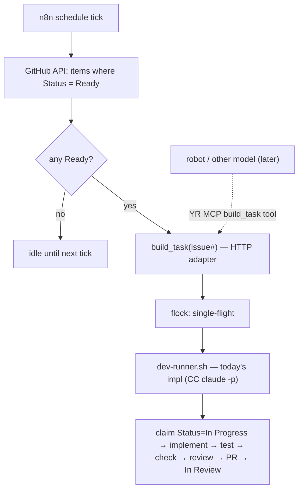

# RFC 0004 — Dispatch (n8n → dev-runner)

**Status:** Accepted — implemented & live (n8n workflow polls Ready → dev-runner) · **Builds on** [0001-ticket-driven-dev-workflow](0001-ticket-driven-dev-workflow.md), [0002-dev-ai-runner](0002-dev-ai-runner.md), [0003-task-state-model](0003-task-state-model.md)

## Context

The dev-runner takes a Ready task to a reviewed, tested PR end-to-end (implement → tester → review; v0.1–v0.3, proven live on #26). It is **manual-trigger** today. v0.5 automates the *invocation* — the step that **switches the factory on**. Status is now a Projects **field** ([0003-task-state-model](0003-task-state-model.md)), so the trigger is an **API poll of the `Status=Ready` column**, not a label webhook.

## Decision

**Dispatch invokes a stable `build_task(issue#) → PR` contract through thin adapters; what's behind it (harness/model) and what's in front of it (caller) both swap freely — nothing is hardwired to a model.**

Two seams, composed:

- **Execution — *what* builds.** `build_task` is the runner contract (RFC 0002): a black box. `dev-runner.sh <issue#>` is today's implementation (CC `claude -p`, Sonnet); OpenClaw or another harness swaps in by **config, not rewiring**.
- **Invocation — *who* calls.** `build_task` is exposed via thin adapters: an **HTTP endpoint** for n8n now, and a **YR MCP tool** as the reusable, model-agnostic surface — any MCP client (CC, OC, another agent) can then drive the factory. One core, two faces.

**Trigger — poll, not webhook.** n8n runs a scheduled job that queries the GitHub API for `Status=Ready` items and calls `build_task` for each. Poll is the robust baseline: webhook delivery is best-effort, so a dropped `projects_v2_item` event would strand a task (breaks "no lost tasks"), and a poll is **self-healing** (each tick re-checks the whole Ready set). Minute-latency is fine for a factory; a webhook fast-path is an *optional later add*, never a replacement for the poll.

## The three things to nail

1. **Adapter + bridge.** n8n can't run the build itself (it's a host process — `claude -p` + git worktrees + the repo on disk; n8n is in Docker). v0.5: a small **host HTTP endpoint** (localhost systemd service) wrapping `build_task` — i.e. `dev-runner.sh <issue#>` under a `flock`; n8n POSTs an issue# to it. The same core gets a **YR MCP `build_task` tool** when robots/models need to invoke the factory (a thin second adapter). *Why not MCP for n8n now:* n8n is a workflow engine RPC-ing, not an LLM using tools — HTTP is its natural fit; MCP's value is agent tool-use.
2. **Single-flight / no double-pickup.** Three layers: the host **lock** serializes (one build at a time); the runner's **claim** (`Ready → In Progress`, its first act) drops the task off the Ready query within seconds; the **`task/<n>` branch** is a final backstop (a duplicate's worktree/push collides). Combined → no task is built twice.
3. **Watched switch-on.** Autonomy stays **off until proven**: start the n8n job **manual-trigger** (or a long interval), watch the first runs, then flip to a schedule. A **kill switch** (disable the n8n workflow, or a flag the endpoint honours) stops all dispatch instantly. The runner already **fail-closes** (Blocks + comments on any error), so a bad task lands in Blocked, not the wild.

## Consequences

- **Reusable from the start:** neither the caller (HTTP / MCP) nor the builder (CC / OC / other model) is hardwired — both are adapters/config over one `build_task`.
- The factory runs itself: a human/Joam promotes a task to `Ready`; the rest happens unattended.
- n8n is the single dispatch surface — observability, retries, manual trigger, and a home for future logic (priorities, multi-repo, notifications).
- **Grooming** (Backlog → Ready, #20) stays a human/Joam judgment — dispatch only *pulls* Ready, never *promotes*.

## Open questions

- Ship the **MCP adapter in v0.5**, or HTTP-only first with an MCP-ready core?
- Host endpoint home + auth (localhost-only? shared token?).
- Does n8n already hold a GitHub credential, or add a scoped token?
- Poll interval, per-tick cap, concurrency (1 to start).
