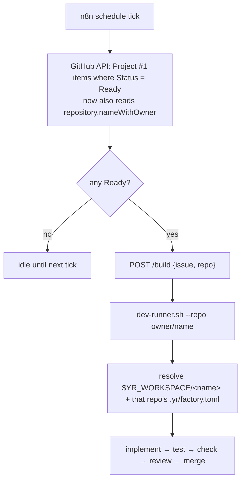

# RFC 0006 — Multi-repo factory & website onboarding

**Status:** Accepted — 2026-06-24 · **Builds on** [0001-ticket-driven-dev-workflow](0001-ticket-driven-dev-workflow.md), [0002-dev-ai-runner](0002-dev-ai-runner.md), [0004-dispatch](0004-dispatch.md), [0005-upper-pipeline](0005-upper-pipeline.md) · **Merge policy** → [0007-autonomous-merge](0007-autonomous-merge.md)

## Context

The factory was built repo-agnostic but proven on **one** product repo (`yellow-robots`). The *execution* seam already routes by repo: `dispatch.py` accepts a `repo` field and passes `--repo`; `dev-runner.sh` resolves the checkout as `$YR_WORKSPACE/<name>` and reads **that repo's** `.yr/factory.toml` (`check_cmd`/`model`/`base_ref`). Nothing in the runner is hardwired to a single repo.

The *invocation* seam is where the single-repo assumption hides. n8n's Ready-poll (RFC 0004) queries Project #1 and emits only the issue **number**; `dispatch.py` then falls back to `DEFAULT_REPO=yellow-robots/yellow-robots`. So **every Ready ticket is implicitly the product repo** — the board can't yet say which repo an issue belongs to.

Meanwhile `website` (`yellow-robots/website`) has stopped being a brochure. It's becoming **product surface** — onboarding, registration, account management — and it will change often as features ship. Hand-built-forever doesn't fit that; it wants the same rigor as the product (builder≠verifier, an independent gate, autonomous merge). This RFC makes the factory genuinely multi-repo and onboards `website` as the proof.

## Decision

**The website is a first-class factory repo, on the same board, under the same process as the product — and the factory becomes repo-aware at the one seam that wasn't.**

1. **Full parity, one board.** `website` shares **Project #1**, the same Status lifecycle, builder≠verifier, and the autonomous merge policy ([0007](0007-autonomous-merge.md) — humans gate the *input* at promotion-to-Ready, not the output). Status field IDs are shared (same project) — no per-repo board machinery.

2. **Routing becomes repo-aware at invocation.** The n8n Ready-poll learns each issue's repo and passes it; the execution side already handles it. The poll query adds `repository { nameWithOwner }`; the filter/POST sends `{issue, repo}`. The repo is taken from the issue's **native repository**, not an added board field — simplest, and always correct.

3. **Proportional ceremony.** Parity does **not** mean RFC-everything. Small site changes are **direct Task issues** (lower pipeline only); substantial features (onboarding, registration, accounts) get the **full upper pipeline** (intent → spec → feature-RFC → technical-RFC → task). This is the same menu the product repo already uses — validate.py's B/C/D polish were direct tasks; only the first feature ran the upper pipeline.

4. **The check gate is per-repo and grows with the repo — driven by the repo, not the factory.** `website`'s gate today is `python3 tools/check.py` — stdlib only (no Node, matching the no-build stack): well-formed HTML, internal links/assets resolve, and **nothing loads from an external origin** (enforcing self-host). It must match **load contexts** (`<link href>`, `<script/img/source src>`, CSS `url()` / `@import url()`, `fetch`), **not** raw `https?://`, or it false-positives on SVG `xmlns` namespaces and library license-comment URLs and Blocks every ticket.

   The factory only verifies what `check_cmd` runs, so the gate **grows as the repo does**: when frameworks and behavior land (auth, accounts), the repo evolves its own `check_cmd` to unit + **visual tests via Playwright** (already in use) + lint — e.g. `npm ci && npm test && npx playwright test` — with **zero factory changes**. Visual correctness is verified by Playwright, not a human's eyes. *When* to adopt a framework (e.g. Astro) is the website AI's call, made when the need arises and integrated by updating its own manifest — the factory doesn't dictate the stack. Environment upkeep (browsers on the host, deps in the worktree) is provisioning, not a design limit.

## Rollout (option A — clean gate from commit one)

The external-origin rule is a **whole-repo invariant**, so main must be clean *before* the gate goes strict — you don't start an invariant in warn-mode. Sequence:

1. Self-host the three fonts (Bangers / Jost / Urbanist) and drop the Google Fonts `@import` — folded **into the v1 PR**, so `site/` work stays in one hand and main lands rule-clean.
2. Merge v1 → main (attended, during bootstrap).
3. Add `tools/check.py` (strict, TDD) + `.yr/factory.toml`; verify green on the clean site.
4. Flip n8n repo-aware (attended; apply to the live workflow).
5. Prove it: one trivial `website` Task issue → Ready → autonomous build → merge.

*(Bootstrap is attended ops, split across two sessions to avoid sharing one git working tree — site builder in the main checkout, integration in a separate worktree. Onboarding a repo is never a Ready ticket.)*

## Consequences

- **The factory is genuinely multi-repo.** Onboarding repo N is now mechanical: clone to `$YR_WORKSPACE/<name>`, add `.yr/factory.toml`, ensure the board can name its repo. `website` is the working proof; the design generalizes.
- **`DEFAULT_REPO` is removed as a router.** Dispatch is **fail-closed**: no repo, no build. The board, via native issue repo, is the single source of truth.
- **One board, many repos.** Read via group-by-repo / per-repo views; native sub-issue and repo metadata carry the grouping for free.
- **Self-host is enforced, not hoped.** A whole-repo strict gate guarantees `website` never phones home — on-message for a product whose pitch is "own your own box."

## Resolved (2026-06-24)

- **Fail-closed, not fallback.** If a Ready ticket's repo can't be determined, dispatch **refuses and logs** — never guesses `DEFAULT_REPO`. Mis-routing a feature into the wrong repo is the nightmare case. Every dispatch path (n8n poll + on-demand `/build`) must carry an explicit repo. *(Sequencing: n8n must send the repo and be verified before the fallback is removed, so the live pipeline never has a dead window.)*
- **No Repo field for now.** Native issue-repo + a group-by-repo view; revisit only if N repos makes filtering painful.
- **Stack evolution is repo-autonomous.** When to adopt Astro (or any framework) is the website AI's call, integrated by updating its own `.yr/factory.toml` — not a factory-level trigger.
- **Visual is automated.** Playwright visual tests in the check gate, already in use — no human visual gate.

## Open questions

- **Merge policy.** The replacement for human-merge — deterministic gates + multi-agent / multi-provider review + machine-checkable acceptance criteria, with deploy kept separate and attended — is factory-wide and specified in [0007-autonomous-merge](0007-autonomous-merge.md).
