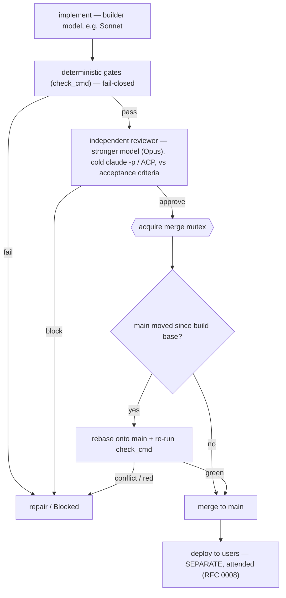

# RFC 0007 — Autonomous merge

**Status:** Draft — proposed (2026-06-24) · **Builds on** [0001-ticket-driven-dev-workflow](0001-ticket-driven-dev-workflow.md), [0002-dev-ai-runner](0002-dev-ai-runner.md) · **Amends** 0001's human-merge gate

## Context

The v1 SDLC ends each ticket at *open PR → **a human merges*** (RFC 0001, human gate #2). The standing position (Jose, 2026-06-22, reaffirmed 2026-06-24): **a human merge gate is a bottleneck with no real value.** Gate the *input* — what's worth doing: the Definition of Ready, promotion to Ready — not the *output*, what was built. Merging code one didn't build is a cognitive load that can't be discharged, and it blocks the very automation the factory exists to provide.

Removing the gate must not drop *below* the human skim it removes — and should beat it over time. So this is a **first iteration, deliberately small**: walk before run. The ambitious version (a multi-provider review panel) is real but too complex and too costly to build first; it's captured under *Future*. The one exception pulled forward is the **merge-skew guard** — parallel agents are imminent, so the concurrency safety feature ships now, not later.

## Decision (first iteration)

**Replace the human merge gate with: deterministic gates pass + one independent reviewer approves → the green build merges itself, under a one-at-a-time merge mutex with a skew re-check. Humans gate the input (promotion-to-Ready), not the output. Merge ≠ ship.**

*The gates and the review are the **build** pipeline (RFC 0002), run pre-PR in the worktree — not a second gate at merge. Autonomous merge means a green build **merges itself**; we remove the human gate, we don't add a machine one. The single thing evaluated at merge time is concurrency: with builds running in parallel, `main` can move between a build's base and its merge — handled by the skew guard (step 3).*

1. **Deterministic gates — fail-closed.** The repo's `check_cmd` (unit + visual + lint + invariants). An *environment* failure Blocks (RFC 0002 F5); it never papers over a broken toolchain.

2. **She who builds is not she who reviews.** Builder ≠ verifier is already the runner's shape (RFC 0002): the reviewer is a separate **cold `claude -p`** (ACP-delegated), never the builder. Two changes from v1:
   - its verdict now **gates the merge** — a clear approve auto-merges, instead of feeding a human;
   - it may run a **stronger model than the builder** (default: build with Sonnet, review with Opus) — the cheapest way to make the gate stronger today, with no new providers.
   It judges the diff against the issue's **acceptance criteria** (already in the DoR / issue form) — no new machinery.

3. **Merge under a skew guard.** A green, reviewed build merges itself — but with parallel builds, `main` can advance between a build's base and its merge. So merges take a **merge mutex** (one merge at a time; builds stay parallel — we serialize the cheap step, not the expensive one). Holding it:
   - `origin/main` **unchanged** since the build's base → **merge directly** (the common, no-op path).
   - `origin/main` **moved** → **rebase onto it and re-run `check_cmd`**; green → merge, conflict or red → Block/repair.

   Nothing re-runs when nothing moved; only the deterministic check re-runs on skew — the review's approval stands, since the change didn't change, only its base. The mutex makes rebase→recheck→merge **atomic**: no sibling merge can slip in between, so the merge lands on exactly the `main` it was re-verified against.

4. **Escalate, don't gate.** Reviewer blocks, a check fails, or a skew rebase conflicts → repair / another round; a hard block stays **Blocked for a human**. The human is the rare exception, not the path.

**Merge ≠ ship.** The factory merges to `main`; deploy to users is separate and attended — its own **RFC 0008**. `main` is not production, which is exactly what makes autonomous merge safe: a bad merge's blast radius is a branch off `main`, caught before it ships.

## Future iterations (deliberately not now — walk before run)

Captured so the aspiration isn't lost; explicitly **out of scope** for the first iteration:

- **Multi-agent / multi-provider panel.** N independent reviewers across *different providers* to decorrelate model blind spots — clearly stronger, but complex and costly. Add a second provider/model when we're ready, upgrading the single reviewer into a panel.
- **Risk-tiering.** More reviewers (or the human exception) for high-risk surfaces (auth, migrations, security); fewer for a copy tweak.
- **Post-merge safety net.** Auto-revert a merge if a signal on `main` goes red after the fact (a smoke test, or CI that only runs on `main`) — undoing a bad merge that slipped the gate.
- **Acceptance criteria as executable tests**, rather than prose the reviewer reads.
- **Full merge queue.** The step-3 guard is the minimal one-at-a-time version; batching and speculative builds are a later optimization, only if merge throughput becomes a bottleneck.

## Consequences

- Output is **autonomous to merge** with mostly the machinery we already have — one cold `claude -p` reviewer — plus a model-tier bump and the small skew guard. No new providers required to start.
- **Builds parallelize; merges serialize.** The merge mutex makes concurrent autonomous merges safe without serializing the expensive build; the no-skew path is a no-op, so the cost is near-zero until `main` actually moves under a build.
- The human role concentrates at the **front** (grooming Backlog → Ready) and at **deploy**.
- Clear upgrade path: the single reviewer becomes a panel when a second provider is worth its cost.
- The DoR's acceptance criteria become load-bearing — the reviewer judges against them, so vague criteria weaken the gate.
