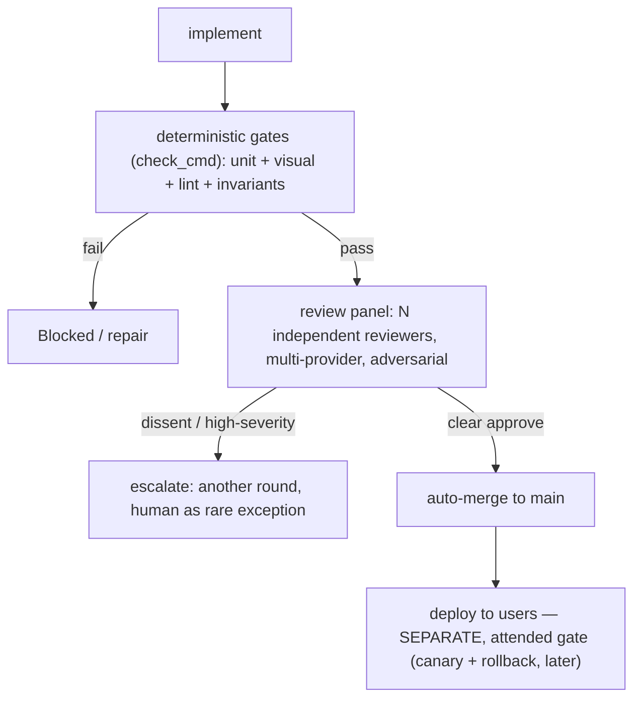

# RFC 0007 — Autonomous merge & verification-in-depth

**Status:** Draft — proposed (2026-06-24) · **Builds on** [0001-ticket-driven-dev-workflow](0001-ticket-driven-dev-workflow.md), [0002-dev-ai-runner](0002-dev-ai-runner.md) · **Amends** 0001's human-merge gate

## Context

The v1 SDLC ends each ticket at *open PR → **a human merges*** (RFC 0001, human gate #2). The standing position (Jose, 2026-06-22, reaffirmed 2026-06-24): **a human merge gate is a bottleneck with no real value.** Gate the *input* — what's worth doing: the Definition of Ready, promotion to Ready — not the *output*, what was built. Merging code one didn't build imposes a cognitive load that can't be discharged, which blocks the very automation the factory exists to provide.

Removing a gate must not remove safety. The merge gate exists to catch correctness bugs, security issues, and spec-mismatch. So the bar is sharp: **the replacement has to be stronger than a human skim, not weaker.** A tired human reading a diff is a low bar; the goal is to clear it decisively, not to drop below it.

## Decision

**The human merge gate is replaced by verification-in-depth. A ticket auto-merges when — and only when — it passes a stack of independent, mostly-deterministic checks. Humans gate the input (promotion-to-Ready); the output is automated. Merge ≠ ship: deploy stays a separate, attended gate.**

Four layers, all must pass:

1. **Deterministic gates — fail-closed.** The repo's `check_cmd`: unit + visual (Playwright) + lint + invariants. Non-negotiable; an *environment* failure Blocks (RFC 0002 F5), it never papers over a broken toolchain.

2. **Builder ≠ verifier, multiplied — multi-agent, multi-provider review.** The single independent reviewer (RFC 0002) becomes a **panel**: N independent reviewers, ideally across **different providers**, so model-specific blind spots decorrelate. Each is prompted adversarially — find a reason *not* to merge, default to "block" under uncertainty. Clear consensus to approve → merge; any high-severity finding or genuine dissent → escalate.

3. **Machine-checkable acceptance criteria.** The DoR (RFC 0001 issue form) carries explicit, checkable acceptance criteria; the panel verifies the build against them, and where possible they are encoded as tests (layer 1). This is where *gate-the-input* pays the output: a sharp spec makes "did it do what we asked" verifiable without a human. Input-gate and output-automation are **coupled** — the front gate is what licenses the autonomy at the back.

4. **Escalation, not a standing gate.** A human is the **rare exception** — panel deadlock, repeated high-severity, an explicitly security-sensitive surface — not the default path. The escape hatch exists; it is not the road.

**Merge ≠ ship.** The factory merges to `main`. Deploy to users is a separate, attended action (already the rule: deploy is never a Ready ticket). The real-stakes gate is *deploy* — and that is exactly why autonomous merge is safe: `main` is not production. A bad merge is caught before it ships; the blast radius is a branch, not a user.

## Consequences

- The factory is **autonomous output-to-merge**; the human role concentrates at the **front** (grooming Backlog → Ready) and at **deploy**.
- **Stronger than a skim:** multi-provider decorrelation + adversarial prompting + deterministic gates catch a class of issues one reader misses.
- **Cost is N reviewers per ticket** (compute + latency) — tunable by risk: a copy tweak needs less than an auth change.
- Requires **multi-provider access** (keys/adapters) and a **panel-orchestration** stage in the runner.
- The DoR/issue-form grows teeth: acceptance criteria become a first-class, checkable artifact, not prose.

## Open questions

- **Provider set + N.** Which providers, how many reviewers, and is N **risk-tiered** (more for auth/security/migrations, fewer for copy)?
- **Panel orchestration.** A runner stage that spawns the panel, or the workflow multi-agent tooling? Vote aggregation — unanimous, majority, or severity-weighted?
- **Acceptance-criteria encoding.** How much is prose-checked by the panel vs. encoded as executable tests? Does the upper pipeline (0005) already emit criteria in a checkable shape, or does the issue form need a dedicated section?
- **Risk signals.** What marks a ticket "high-risk" → more reviewers or the human exception (touches auth? migrations? a security label? a sensitive path glob)?
- **Deploy gate.** In scope here, or its own RFC 0008? *(Lean: its own — merge and deploy are different stakes.)*
- **Post-merge safety.** Auto-revert on a post-merge signal (CI on `main`, a smoke test)?
