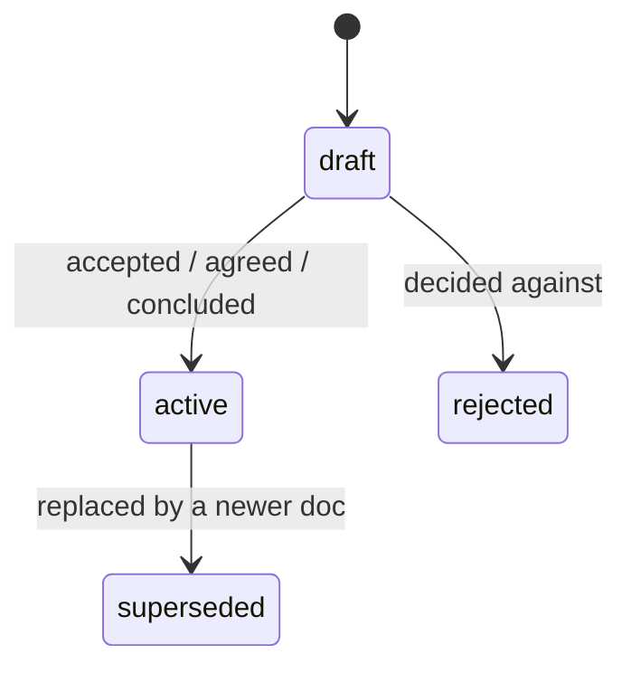

# The Yellow Robots documentation model

> The living reference for how the Yellow Robots factory documents a product — one iteration at a time, so AIs and humans can build it together. **Relocated from the vault `01-conventions` (iteration `3-upper-pipeline`), which it supersedes**; this is now the single living copy, versioned with the skill. Read it before creating or editing any doc in a component's brain.

## Two principles

1. **Documentation exists to enable the next iteration** — enough to understand the current state and decide the next change soundly, no more. Past docs are the frozen record of *why*: the decisions taken and the arguments that supported them.
2. **Code is king.** The code is the embodiment of every past decision. When docs and code disagree, **code is the present truth**; the docs are history. We evolve the code; we read the docs to know why it is shaped as it is.

A consequence worth stating plainly: **shipping freezes the why.** When an iteration lands, its `product-spec` / `feature-rfc` / `technical-rfc` become a dated, immutable record. We never re-edit them to match a later reality — a later change gets its *own* later iteration. (So "amend RFC 0002 to match the runner that was actually built" is the wrong move: the drift is recorded by the *next* iteration, not by rewriting the frozen one.)

## The unit: an iteration

- **We work in iterations.** An iteration is one coherent change to the product, from intent to shipped code.
- **Iterations are not uniform** — one may be a one-line fix, another a whole subsystem. We **encourage small**: the smaller the iteration, the cheaper its why-record and the clearer the history.
- **Iterations are ordered** — you read them in the order they happened. Order lives in the numbered iteration folders (`1-…`, `2-…`) and the ordinal in each filename.
- **An iteration is a container.** It groups the documents that explain *what* the change is and *why*, and links them to the code that resulted. Even the broad, sometimes far-fetched research you do at the start of a change belongs to the iteration that spawned it.
- **Iterations live in an `iterations/` folder — and *everything inside it is an iteration*,** governed by this model, no exceptions. That claim is absolute precisely because it is *scoped*: **alongside `iterations/`, a component may grow governed cross-cutting homes** — optional domain-noun folders, see *The cross-cutting layer* — **and free-form brain** — business, legal, marketing, an ideas-backlog, and an optional **orientation note** (its contract is the next bullet) — that this model does not govern. Free-form docs still carry the base frontmatter (see *Frontmatter*) but sit outside the spine. A folder draws the line, so the strong rule and the freedom coexist. **Org-level cross-cutting homes sit above every component** — today `brand/` (the YR identity home, upstream of GTM and the website) and `strategy/`, plus an org-level ideas-backlog when born; brand assets live there, not in a component's free-form brain.
- **The orientation note — the one free-form doc with a contract.** A component's *working context*: purpose + north-star, conventions, what's deliberately not built, open threads. **Context only — never an index of iterations** (that is `ls` + each `01`, and it is the part that rots: an unscoped overview note decays into a dead stub). Hand-authored and optional, never auto-generated; `type: note`; it *cites* the repo's `AGENTS.md`, never duplicates it. This is the line between a durable orientation note and the hub note the model forbids — orientation = working context, hub = duplicated structure.

## The document types

The iteration's **spine** is four types, in order. Two are always present; the middle two are *earned* — a small iteration skips them.

| `type` | is | per iteration | present when |
|---|---|---|---|
| `product-spec` | the intent — WHAT/WHY only, no tech; acceptance criteria in EARS | **exactly 1** | always |
| `feature-rfc` | the design/argument for one feature of the iteration | 0..N | a feature is worth arguing |
| `technical-rfc` | the codebase-fit design that makes a task self-contained | 0..1 per feature-rfc, or 0..1 per product-spec directly when no feature-rfc is earned | codebase-fit is non-obvious, or the builder ≠ the author |
| `task` | a self-contained unit of work (a GitHub Issue) | **1..N** | always |

Chain: `product-spec —1:N→ feature-rfc —1:1→ technical-rfc —1:N→ task`. **The floor is `product-spec → task(s)`** — a tiny iteration needs only its intent and its work items; the two rfc layers are added only when complexity demands. When the design argument is already settled in the spec (no feature-rfc earned) but codebase-fit still isn't obvious, the technical-rfc is earned **directly off the product-spec**, skipping the feature-rfc — see *The airlock*.

Three more types **support** the spine — they belong to an iteration but are not in the chain:

| `type` | is |
|---|---|
| `research` | an investigation or prior-art survey and its findings — a frozen "what we found about X" |
| `note` | the **wildcard**: any other document the project needs — a marketing brief, a legal doc, a distilled how-X |
| `runbook` | an operational how-to (imperative steps + verification); cross-cutting / host-ops only |

No other types. `research` is frozen (dated; you stop editing it) — its `active` status is
concluded-and-citable dated testimony, never a claim about the present (see *Lifecycle*). `note` and
`runbook` are living.

## The airlock (Obsidian ↔ GitHub)

The spine spans two homes, crossed **once**:

- **Obsidian — the brain:** `product-spec`, `feature-rfc`. The design and the why. Authored and kept here.
- **GitHub — the build surface:** `technical-rfc` (on the epic Issue), `task` (Issues), the PR. The how, the work, the record.
- The crossing is at **feature-rfc → technical-rfc**: an agent reads the feature-rfc and **creates** the technical-rfc on GitHub. It **cites, never copies** — there is no mirror to drift. A small iteration that skips the rfc layers crosses at `product-spec → task` directly.
- A third variant sits between those two: **product-spec → technical-rfc (on the epic Issue)**. When the design argument is already settled in the spec — no feature-rfc earned — but codebase-fit is still non-obvious (or the builder ≠ the author), an agent reads the product-spec and **creates** the technical-rfc on GitHub directly, skipping the feature-rfc. It carries `source_spec` (not `source_feature_rfc`) as its up-spine link — `source_spec` is already in the closed frontmatter vocabulary, so no new key is introduced. It, too, **cites, never copies**.

The crossing is **fail-loud**: a `source_*` link that does not resolve **stops** the workflow (`check_links`). Obsidian cannot veto a bad save — the vault is an *open lens* — so the integrity gate lives in **code**, run on the draft *before* it crosses, never in the editor.

## Identity & navigation

- **The filename carries the id.** Each doc is `NN-slug.md` — a two-digit ordinal within its iteration (the product-spec is always `01`), then a kebab-case noun phrase. The ordinal *is* the id: assigned once at creation, monotonic, **never reused or renumbered** (gaps record history). Order shows at a glance in any listing — there is no `id` property; the filename is the identity.
- **The folder is the iteration.** Iterations are numbered folders in ship order; a doc's iteration is its folder, not a property.
- **The product-spec (`01`) is the iteration's front door** — it states the intent and links the iteration's features and research. There is no separate hub note.
- **Every doc links its neighbours, navigably:**
  - *up the spine* — `source_*` frontmatter (`source_spec`, `source_feature_rfc`, `source_technical_rfc`): a `[[wikilink]]` when the target is in Obsidian, a `#issue`/URL when on GitHub. These are exactly the crossing-links `check_links` verifies. (The **product-spec is the pipeline root** — it carries no `source_*`; intent/vision is a human brain doc *outside* the pipeline, referenced in prose if useful, never a gated crossing-link.)
  - `crossed_to` records where a design crossed the airlock — the epic Issue ref (`owner/repo#N`), or a repo path for a file crossing. **Stamped at the crossing itself**, in the attended session that files the epic — never deferred to close: a missing stamp is silent and ambiguous (not-yet-crossed vs. forgot), while a stamp on an epic later closed *not planned* is loud, true history — the epic records its own outcome.
  - everything else (related / builds-on / see-also) is a prose `[[wikilink]]` in context.

## Frontmatter — one closed vocabulary

Every doc — spine, supporting, or free-form brain — carries the *same* small property set. It is a **closed vocabulary: never invent keys.** (An AI left free to add properties invents hundreds of nonsensical ones; a fixed set keeps the brain queryable as it grows into product, business, and legal.) Anything not on this list belongs in the **body**, not the frontmatter.

- **Base — every doc:** `type` · `status` · `created` · `updated`.
- **Crossing-links — only where they apply:** `source_spec` / `source_feature_rfc` / `source_technical_rfc` (the up-spine link; the product-spec is the root and carries none) · `crossed_to` (where a design crossed — stamped at the crossing) · `supersedes` (the declaration: required on `product-spec` and `feature-rfc` at authoring — a list of `[[wikilink]]`s naming what this doc replaces; empty (`[]`) is allowed only with a one-line body justification; never on a task) / `superseded_by` (the reverse edge, set on the target) / `retired_reason` (on retirement).
- **Link idiom.** Vault-internal references in vault docs are wikilinks — the double-square-bracket form — never paths: wikilinks survive renames and moves; backtick paths are for repo files only.

That is the whole set — grown by exactly one key this iteration, `supersedes` (the declaration
counterpart to the pre-existing `superseded_by`). `title` is the H1, not a field; `stage` is the `type`; `home` is the `type`; the component and iteration are the **folder** — none of them are frontmatter. A new area (legal, marketing, business) earns a new **`type`** deliberately when it's built out; until then those docs are `note`, the wildcard.

## Naming

- **Filename:** `NN-slug.md` — the ordinal, then a lowercase-kebab **noun phrase** for the thing, ≤ ~4 words. No type, no date, no iteration word, no "the/factory" — the folder and frontmatter already carry those. Stable once set; renaming means a **link-safe rename** (see *Editing safely*).
- **Folder (iteration):** `<n>-<slug>/` — ordinal + kebab noun phrase (`1-build-pipeline`).
- **Title (H1):** human prose; may differ from the slug; not a frontmatter field.
- **Across the airlock:** the repo keeps its own `000N` RFC numbers (git can't rewrite links, so it needs explicit stable numbers); the Obsidian feature-rfc records the crossing with `crossed_to`. The two number-spaces are independent — don't force them to match.

## Lifecycle



- `draft → active` is a deliberate decision, not automatic.
- **Crossing to a repo does not change status** — a built doc stays `active`, recorded with `crossed_to`. A doc retires only when a newer one replaces it (`superseded`, with `superseded_by`).
- Supersession is a **state, not a move**: set the status, don't relocate the file (`archive/` is for retiring a whole era, not a single doc).
- **Supersession needs a posterior invalidator — a *move* is not a supersession.** A doc goes `superseded` only when a *later* doc changed the decision. A doc whose content merely **moved** — re-homed onto the model, the decision unchanged — was *migrated*: the original is **deleted** (its content now lives at the new path; the bytes survive in `.trash`/git), never tombstoned. Mislabelling a move as `superseded` lies about history and leaves a drift-prone duplicate.
- **The accept act stamps the pair.** The attended session that accepts a declaring doc (`draft → active` on a `product-spec` or `feature-rfc` carrying `supersedes`) stamps every named target `status: superseded` with its `superseded_by` back-pointer to the replacer, **in that same session** — tombstones land at accept, never deferred to close. The accepting session then runs the supersession sweep (`check_supersession.py --sweep`, see [`gates.md`](gates.md)) to verify every pair it just created.
- **The down-flow rule.** A superseded `product-spec` obliges a disposition for every *active* spine doc whose `source_spec` resolves to it: each must be named directly in the declaring doc's `supersedes` list, or cited in its body as carried forward from the replacing intent. An undispositioned child is a hard finding for `check_supersession`.
- **Supporting docs (`research`/`note`/`runbook`) read `active` differently.** For these, `active` means *concluded-and-citable dated testimony* — never a claim about the present state of things. Freshness is **event-driven**, via an optional named revisit trigger in the doc's body — never gated on a clock. `research` is superseded only by newer research, never by a spine doc. For this gloss, no new status value is introduced — the same `draft`/`active`/`rejected`/`superseded` set already covers supporting docs.
- **This model reference is *living*** — like code (king, always current), it is kept up to date. *Shipping freezes the why* was always scoped to iteration **spine** docs (`product-spec`/`feature-rfc`/`technical-rfc`); supporting types (`research`/`note`/`runbook`) were always living, and this reference — like any component's living reference (*The cross-cutting layer*) — is one of them: not an exemption from the freeze, an **obligation** to stay current on top of it. It ships as a version of the factory skill; its history is the skill's version history. Every shipped spine doc (spec/rfc) is frozen; a change to one is a new iteration, never a rewrite — so their `updated:` only ever reflects a frontmatter normalization.

## Reviewing a doc

A **review** of a `product-spec` or `feature-rfc` (human or agent) is an *activity that feeds a gate* — **not a spine type, and it earns no frontmatter key.** Where its output goes depends on weight:

- **Light — fold in.** Durable findings fold into the reviewed doc's own sections (Open questions, Alternatives, Consequences) and, for build-level points, into the `technical-rfc` and the task's acceptance. The `status` transition (`draft → active`) is the record that review happened. **No review appendix survives into a shipped doc** — a frozen spine doc is clean rationale, not a comment thread (*docs are consolidated, not accreted*).
- **Heavy — its own doc.** When the critique *itself* carries durable why the folded-in doc won't show (an adversarial, verified, multi-finding assessment), freeze it as a **standalone supporting doc**: `research` (a frozen "what we found reviewing X") for a substantive assessment, `note` if lighter. It takes its own `NN-slug.md` ordinal in the iteration, names its reviewer / date / method in the body, states what it reviewed, and is cited in prose (`[[wikilink]]`) from the reviewed doc — never via `source_*` (that is for spine crossing-links only). One review doc may cover a feature's whole design (its spec criteria + feature-rfc together).

The test is not a finding-count: *does the review's reasoning belong in the frozen record, or is folding its conclusions enough?* When unsure, fold — a standalone review is **earned**, like the rfc layers.

**On GitHub this is already solved.** `technical-rfc`, `task`, and PRs review **natively** — Issue/PR comments plus the lower-pipeline verdict — ephemeral by design. This convention is for the **Obsidian** brain docs only; don't carry the appendix habit across the airlock.

## Structure

A component's governed space is **`iterations/`**, plus any **cross-cutting homes** it has grown (*The cross-cutting layer*, next); free-form brain sits alongside both. Inside an iteration, the spine and its research sit flat, and the Base sorts them by `type`/`status`.

```
04 projects/<program>/       org level — cross-cutting homes above every component: brand/ (YR identity,
                              upstream of GTM and the website) · strategy/ · an org-level ideas-backlog when born
04 projects/<program>/<component>/
  iterations/                 the governed space — everything in here is an iteration
    1-<iteration>/              a numbered iteration (ship order)
      01-<product-spec>.md        the intent — the iteration's front door
      02-<feature-rfc>.md …       NN-<research>.md   (technical-rfc/task live on GitHub)
    2-<iteration>/ …
  architecture/ · operations/ · strategy/ …   optional cross-cutting homes — domain-noun folders,
                              fully governed, supporting types only (research/note/runbook)
  <free-form brain>           business · legal · marketing · ideas-backlog · optional orientation note
                              — base frontmatter only, outside every governed space
```

Materialize only what's earned — a lone iteration's docs sit flat in its folder; a component with no cross-cutting homes and no free-form material is just `iterations/`.

## The cross-cutting layer

Iterations are frozen at ship — right for the *record* of a change, wrong for the *map of the present*. A component that grows complex enough accumulates durable knowledge that fits neither space the model otherwise offers: not an iteration (it isn't a change), not free-form (a cold agent can't trust it without rules). The cross-cutting layer is that third space, adopted on need.

### Cross-cutting homes

Alongside `iterations/`, a component may grow **domain-noun folders** — `architecture/`, `operations/`, `strategy/`, and so on. **The folder draws the line, exactly as with `iterations/`:** any domain-noun folder sitting alongside `iterations/` is a **governed home** — fully governed by this model: the same closed frontmatter vocabulary (*Frontmatter*), **supporting types only** (`research` · `note` · `runbook`) — **never spine types** (`product-spec`/`feature-rfc`/`technical-rfc`/`task` belong to an iteration, never a home). Loose files at the component root stay free-form, exactly as before. `operations/` holds **executed records**: runbooks and the scripts that run alongside them. Homes are adopted on need — a component with none of them stays on the unmodified model.

### The living reference

A component may declare **at most one living reference**: a `note` holding the cross-cutting big picture (what it must be · how it's built · deployed · maintained), **kept current**. At most one, because a component has one big picture — a second is the first step back toward the hub note this model bans; further detail belongs in the domain homes' own `research`/`runbook` docs, cited from the reference. A living reference names which of its sections are **load-bearing** — the component's architect charter defines the set; touching a load-bearing section is an architect earn-arm.

**The mirror line** is what separates a living reference from a banned mirror: it may render cross-cutting facts as a **navigational summary**, *provided* every fact **cites its authoritative home** and **none is asserted on the reference's own authority.** It cites, never copies. When code ships, its "how" sections become **pointers into the repo**.

*Shipping still freezes the why* — that doesn't change: iteration **spine** docs stay frozen at ship, exactly as *The document types* describes. Supporting types were always living; the living reference is one, and what this layer adds is an **obligation** to keep it current (the *write at ship* trigger below), not an exemption from the freeze.

### The admission test

A new cross-cutting doc must **name its update trigger** — one of the maintenance-contract entries below — to be created at all. An agent must **refuse** to create one that cannot.

### Grounding: every iteration cites what it depends on

Where a component has cross-cutting homes, every iteration's `01` must **cite, in prose `[[wikilink]]`s, the cross-cutting doc(s) it relies on or affects.** This is a prose *see-also* link like any other (*Identity & navigation*) — the frontmatter vocabulary stays closed, no new key.

### The maintenance contract

The closed set of update triggers. Each binds to a **named factory moment**; enforcement is **procedural** — a named step of the operation that owns the moment — **not automated** (no new tooling this iteration):

| Trigger | Binds to |
|---|---|
| **Grounding** | authoring the `01` — cite the cross-cutting doc(s) it relies on or affects |
| **Read at spec-ready** | the spec-ready gate — verify the grounding docs still hold true before the spec goes `active` |
| **Write at ship** | the iteration close — walk the grounding list: the living reference updates in place (the **architect's** ship-walk where that role is earned on the component, the **closing session's** otherwise); `research` is **superseded**, never edited |
| **Executed records** | the operation's own execution — `operations/` appends when the operation runs, on its own clock |
| **Framing events** | the framing conversation — a human framing/vision change lands in the living reference the same day, attributed and dated |

**Advisory defaults for the free-form root** — convention, not governance: `strategy/` content is revisited before program-level decisions; the ideas backlog stays append-only, mined at spec time; the orientation note co-evolves on custody or model changes. These stay free-form, outside the governed homes — the defaults are conventions an operation reminds about, not gates.

The hub/index-note ban **stands**: a computed view over maintained frontmatter — filtered/grouped, never hand-kept — is the only sanctioned dashboard form, because it holds no facts of its own and so cannot drift.

**Named accepted gap.** Grounding citations are prose wikilinks; nothing machine-gates them (`check_links` verifies spine crossing-links only, not cross-cutting grounding). A missing or stale grounding citation is caught only procedurally, at the two bound moments above — or not at all. Accepted for now, under no-new-tooling; revisit if it bites.

## Editing safely

The vault is an **open lens** — Obsidian will save anything; it cannot veto a bad state. So the integrity gate lives in **code at the airlock** (`check_links`, `check_task`), run on the draft *before* it crosses — never in the editor.

- **Load the `obsidian` skills before you touch the vault** — they are the safe interface:
  - **`obsidian:obsidian-cli`** — read / search / create notes, set properties, list backlinks, and do **link-safe renames**. A rename must go through Obsidian so every backlink follows: `obsidian eval code="app.fileManager.renameFile(app.vault.getAbstractFileByPath('old/path.md'),'new/path.md')"`. **Never `mv` a vault file** — a filesystem rename silently breaks links across the whole vault (the archive included).
  - **`obsidian:obsidian-markdown`** — wikilinks, callouts, frontmatter, embeds.
  - **`obsidian:obsidian-bases`** — the `.base` views that filter / group the brain by `type` / `status`.
- **Writes are app-mediated** — the `obsidian` CLI (or the Local REST API), never a blind filesystem overwrite of a file the app may hold open. Create new files freely. To **edit a doc's body**, rewrite the whole file *through the app* — `obsidian create path=… content=… overwrite`, or a REST `PUT` — which is safe where a shell redirect is not; for a surgical change, GET-modify-PUT so untouched text stays byte-identical. **Folders don't auto-create:** `create path=…` / `renameFile` need the parent to exist first (`obsidian eval code="app.vault.createFolder('<component>/iterations/<n>-<slug>')"`).
- **Never mass-rewrite existing frontmatter blindly.** Normalize *with* the human, against the board — validate before accept (a past cron janitor that auto-corrected vault state resurrected finished tasks).
- The vault is **live + synced** — prefer app-mediated writes and link-safe renames over any filesystem mutation.
