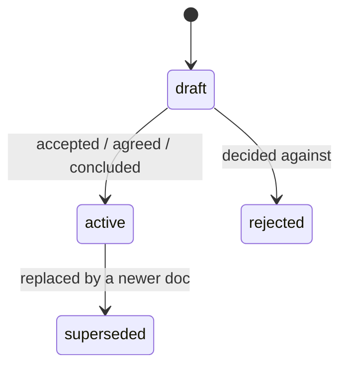

# The Yellow Robots documentation model

> The living reference for how the Yellow Robots factory documents a product — one iteration at a time, so AIs and humans can build it together. **Relocated from the vault `01-conventions` (iteration `3-upper-pipeline`), which it supersedes**; this is now the single living copy, versioned with the skill. Read it before creating or editing any doc in a component's brain.

## Two principles

1. **Documentation exists to enable the next iteration** — enough to understand the current state and decide the next change soundly, no more. Past docs are the frozen record of *why*: the decisions taken and the arguments that supported them.
2. **Code is king.** The code is the embodiment of every past decision. When docs and code disagree, **code is the present truth**; the docs are history. We evolve the code; we read the docs to know why it is shaped as it is.

A consequence worth stating plainly: **shipping freezes the why.** When an iteration lands, its `product-spec` / `feature-rfc` / `technical-rfc` become a dated, immutable record. We never re-edit them to match a later reality — a later change gets its *own* later iteration. (So "amend RFC 0002 to match the runner that was actually built" is the wrong move: the drift is recorded by the *next* iteration, not by rewriting the frozen one.)

**The freeze protects the argument, not the defects (the human's ruling, 2026-07-30).** What is frozen is the *decision and the reasoning that supported it* — the WHAT, the WHY, the alternatives weighed. It was never a guarantee that a broken artifact stays broken. A **functional defect** in a **vault** doc is **repaired in place, however frozen the doc is**, and the test is one question: **would the edit change what the document says, or only whether a reader can follow it?** Changing what it says is a new iteration; making it navigable again is maintenance — no iteration, no supersession, no tombstone. We keep historical records legible.

The repairable set is **closed** — a dead wikilink, an anchor the brain cannot resolve, a link orphaned by a rename, and frontmatter whose *syntax* is broken while every value is still legible (an unterminated fence, a BOM, a leading blank line). Nothing else is added to this list without a ruling. Four exclusions carry the weight, each learned the hard way:

- **Text that quotes the defect is not a defect.** A doc citing a broken form as its own exhibit, or showing one inside a code span, means what it shows: repairing it makes the document assert something false. This is not hypothetical — the ruling's own first execution did exactly that to a frozen spec and had to be reverted.
- **No valid target ⇒ leave it and record it.** When nothing resolvable exists to point at — the target is a repo file, another brain, a document that does not exist, or the reference is an item ordinal rather than a section — the reference **stays as it is**, and the finding is recorded rather than forced. A gate that cannot reach zero is not a licence to invent a target.
- **Values are never reconstructed.** A property-less doc whose values are *gone* is not a syntax repair; inferring a lost `status` or `supersedes` writes a lie into the supersession graph. That routes to the human — see *Editing safely*, **never mass-rewrite existing frontmatter blindly**.
- **Declarations are not navigation.** `crossed_to` · `source_*` · `supersedes` values are *claims about history*, not conveniences for a reader. A dangling one is a finding for the human, never a repair.

The repaired form must be one the brain actually resolves — a heading link `[[Note#Heading]]` or block reference `[[Note#^blockid]]`, aliased where the prose should keep its original reading (`[[Note#2. Mechanism map|§2]]`), with heading text matching a real heading. `check_supersession.py --integrity --scope <component>` is the detector (see [`gates.md`](gates.md)).

A repair is **still a write to a live vault**: it bumps `updated:` and it is invisible afterwards, since the vault has no version history. So a repair pass **records itself** — a dated line in the iteration's own walk entry, or a dated batch record — rather than relying on whoever ran it to have been diligent.

## The unit: an iteration

- **We work in iterations.** An iteration is one coherent change to the product, from intent to shipped code.
- **Iterations are not uniform** — one may be a one-line fix, another a whole subsystem. We **encourage small**: the smaller the iteration, the cheaper its why-record and the clearer the history.
- **Iterations are ordered by slot.** The folder ordinal records the **slot** an iteration was ranked into — assigned once at ranking, monotonic; **ship order is read from each `01`'s `crossed_to` epic and that epic's close**, never from the folder listing (the owner's ruling at the it-29 accept, 2026-08-03: the tree had already diverged twice — it-19/it-20 by hours, it-23 by a week). Renumbering stays forbidden under the identity rule.
- **An iteration is a container.** It groups the documents that explain *what* the change is and *why*, and links them to the code that resulted. Even the broad, sometimes far-fetched research you do at the start of a change belongs to the iteration that spawned it.
- **Iterations live in an `iterations/` folder — and *everything inside it is an iteration*,** governed by this model, no exceptions. That claim is absolute precisely because it is *scoped*: **alongside `iterations/`, a component may grow governed cross-cutting homes** — optional domain-noun folders, see *The cross-cutting layer* — **and free-form brain** — business, legal, marketing, and an optional **orientation note** (its contract is the next bullet) — that this model does not govern. Free-form docs still carry the base frontmatter (see *Frontmatter*) but sit outside the spine. Sitting between the two is one **named, lightly-governed class**: the **ideas-backlog** (`ideas/`) — free-form in spirit (append-only capture, no argued design) but pinned frontmatter in letter, its complete per-file shape stated in *The ideas-backlog*, below. A folder draws the line, so the strong rule and the freedom coexist. **Org-level cross-cutting homes sit above every component** — today `brand/` (the YR identity home, upstream of GTM and the website) and `strategy/`, plus an org-level ideas-backlog when born; brand assets live there, not in a component's free-form brain.
- **The orientation note — the one free-form doc with a contract.** A component's *working context*: purpose + north-star, conventions, what's deliberately not built, open threads. **Context only — never an index of iterations** (that is `ls` + each `01`, and it is the part that rots: an unscoped overview note decays into a dead stub). Hand-authored and optional, never auto-generated; `type: note`; it *cites* the repo's `AGENTS.md`, never duplicates it. This is the line between a durable orientation note and the hub note the model forbids — orientation = working context, hub = duplicated structure.

## The document types

The iteration's **spine** is four types, in order. Two are always present; the middle two are *earned* — a small iteration skips them.

| `type` | is | per iteration | present when |
|---|---|---|---|
| `product-spec` | the intent — WHAT/WHY only, no tech; acceptance criteria in EARS | **exactly 1** | always |
| `feature-rfc` | the design/argument for one feature of the iteration | 0..N | a feature is worth arguing |
| `technical-rfc` | the codebase-fit design that makes a task self-contained | 0..1 per feature-rfc, or 0..1 per product-spec directly when no feature-rfc is earned | codebase-fit is non-obvious, or the builder ≠ the author |
| `task` | a self-contained unit of work (a GitHub Issue) | **1..N** | always |

Chain: `product-spec —1:N→ feature-rfc —1:1→ technical-rfc —1:N→ task`. **The floor is `product-spec → task(s)`** — a tiny iteration needs only its intent and its work items; the two rfc layers are added only when complexity demands. When the design argument is already settled in the spec (no feature-rfc earned) but codebase-fit still isn't obvious, the technical-rfc is earned **directly off the product-spec**, skipping the feature-rfc — see *The airlock*.

Three more types **support** the spine — they belong to an iteration but are not in the chain:

| `type` | is |
|---|---|
| `research` | an investigation or prior-art survey and its findings — a frozen "what we found about X" |
| `note` | the **wildcard**: any other document the project needs — a marketing brief, a legal doc, a distilled how-X |
| `runbook` | an operational how-to (imperative steps + verification); cross-cutting / host-ops only |

No other types. `research` is frozen (dated; you stop editing it) — its `active` status is
concluded-and-citable dated testimony, never a claim about the present (see *Lifecycle*). `note` and
`runbook` are living.

## The airlock (Obsidian ↔ GitHub)

The spine spans two homes, crossed **once**:

- **Obsidian — the brain:** `product-spec`, `feature-rfc`. The design and the why. Authored and kept here.
- **GitHub — the build surface:** `technical-rfc` (on the epic Issue), `task` (Issues), the PR. The how, the work, the record.
- The crossing is at **feature-rfc → technical-rfc**: an agent reads the feature-rfc and **creates** the technical-rfc on GitHub. It **cites, never copies** — there is no mirror to drift. A small iteration that skips the rfc layers crosses at `product-spec → task` directly.
- A third variant sits between those two: **product-spec → technical-rfc (on the epic Issue)**. When the design argument is already settled in the spec — no feature-rfc earned — but codebase-fit is still non-obvious (or the builder ≠ the author), an agent reads the product-spec and **creates** the technical-rfc on GitHub directly, skipping the feature-rfc. It carries `source_spec` (not `source_feature_rfc`) as its up-spine link — `source_spec` is already in the closed frontmatter vocabulary, so no new key is introduced. It, too, **cites, never copies**.

The crossing is **fail-loud**: a `source_*` link that does not resolve **stops** the workflow (`check_links`). Obsidian cannot veto a bad save — the vault is an *open lens* — so the integrity gate lives in **code**, run on the draft *before* it crosses, never in the editor.

## Identity & navigation

- **The filename carries the id.** Each doc is `NN-slug.md` — a two-digit ordinal within its iteration (the product-spec is always `01`), then a kebab-case noun phrase. The ordinal *is* the id: assigned once at creation, monotonic, **never reused or renumbered** (gaps record history). Order shows at a glance in any listing — there is no `id` property; the filename is the identity.
- **The folder is the iteration.** Iterations are numbered folders in **slot order** (ship order reads from the crossing — see *The unit: an iteration*); a doc's iteration is its folder, not a property.
- **The product-spec (`01`) is the iteration's front door** — it states the intent and links the iteration's features and research. There is no separate hub note.
- **Every doc links its neighbours, navigably:**
  - *up the spine* — `source_*` frontmatter (`source_spec`, `source_feature_rfc`, `source_technical_rfc`): a `[[wikilink]]` when the target is in Obsidian, a `#issue`/URL when on GitHub. These are exactly the crossing-links `check_links` verifies. (The **product-spec is the pipeline root** — it carries no `source_*`; intent/vision is a human brain doc *outside* the pipeline, referenced in prose if useful, never a gated crossing-link.)
  - `crossed_to` records where a design crossed the airlock — the epic Issue ref (`owner/repo#N`), or a repo path for a file crossing. **Stamped at the crossing itself**, in the attended session that files the epic — never deferred to close: a missing stamp is silent and ambiguous (not-yet-crossed vs. forgot), while a stamp on an epic later closed *not planned* is loud, true history — the epic records its own outcome.
  - everything else (related / builds-on / see-also) is a prose `[[wikilink]]` in context.

## Frontmatter — one closed vocabulary

Every doc — spine, supporting, or free-form brain — carries the *same* small property set. It is a **closed vocabulary: never invent keys.** (An AI left free to add properties invents hundreds of nonsensical ones; a fixed set keeps the brain queryable as it grows into product, business, and legal.) Anything not on this list belongs in the **body**, not the frontmatter.

- **Base — every doc:** `type` · `status` · `created` · `updated`.
- **Crossing-links — only where they apply:** `source_spec` / `source_feature_rfc` / `source_technical_rfc` (the up-spine link; the product-spec is the root and carries none) · `crossed_to` (where a design crossed — stamped at the crossing) · `supersedes` (the declaration: required on `product-spec` and `feature-rfc` at authoring — a list of `[[wikilink]]`s naming what this doc replaces; empty (`[]`) is allowed only with a one-line body justification; never on a task) / `superseded_by` (the reverse edge, set on the target) / `retired_reason` (on retirement).
- **Link idiom.** Vault-internal references in vault docs are wikilinks — the double-square-bracket form — never paths: wikilinks survive renames and moves; backtick paths are for repo files only.

That is the whole set for **spine docs and supporting docs outside `ideas/`** — grown by exactly one key this iteration, `supersedes` (the declaration counterpart to the pre-existing `superseded_by`). **Inside `ideas/`** the per-location set grows by three more — `summary` / `value` / `effort` (*The ideas-backlog*, below) — closed to that location alone; outside `ideas/` those three stay alien-key observations, exactly as before. Total across the three doc classes — spine, supporting outside `ideas/`, and ideas — this iteration adds four keys, never a global fifth. `title` is the H1, not a field; `stage` is the `type`; `home` is the `type`; the component and iteration are the **folder** — none of them are frontmatter. A new area (legal, marketing, business) earns a new **`type`** deliberately when it's built out; until then those docs are `note`, the wildcard.

## Naming

- **Filename:** `NN-slug.md` — the ordinal, then a lowercase-kebab **noun phrase** for the thing, ≤ ~4 words. No type, no date, no iteration word, no "the/factory" — the folder and frontmatter already carry those. Stable once set; renaming means a **link-safe rename** (see *Editing safely*).
- **Folder (iteration):** `<n>-<slug>/` — ordinal + kebab noun phrase (`1-build-pipeline`).
- **Title (H1):** human prose; may differ from the slug; not a frontmatter field.
- **Across the airlock:** the repo keeps its own `000N` RFC numbers (git can't rewrite links, so it needs explicit stable numbers); the Obsidian feature-rfc records the crossing with `crossed_to`. The two number-spaces are independent — don't force them to match.

## Lifecycle


```mermaid
stateDiagram-v2
    [*] --> draft
    draft --> active: accepted / agreed / concluded
    draft --> rejected: decided against
    active --> superseded: replaced by a newer doc
```

- `draft → active` is a deliberate decision, not automatic.
- **Crossing to a repo does not change status** — a built doc stays `active`, recorded with `crossed_to`. A doc retires only when a newer one replaces it (`superseded`, with `superseded_by`).
- Supersession is a **state, not a move**: set the status, don't relocate the file (`archive/` is for retiring a whole era, not a single doc).
- **Supersession needs a posterior invalidator — a *move* is not a supersession.** A doc goes `superseded` only when a *later* doc changed the decision. A doc whose content merely **moved** — re-homed onto the model, the decision unchanged — was *migrated*: the original is **deleted** (its content now lives at the new path; the bytes survive in `.trash`/git), never tombstoned. Mislabelling a move as `superseded` lies about history and leaves a drift-prone duplicate.
- **The accept act stamps the pair.** The attended session that accepts a declaring doc (`draft → active` on a `product-spec` or `feature-rfc` carrying `supersedes`) stamps every named target `status: superseded` with its `superseded_by` back-pointer to the replacer, **in that same session** — tombstones land at accept, never deferred to close. The accepting session then runs the supersession sweep (`check_supersession.py --sweep --scope <component>`, see [`gates.md`](gates.md)) to verify every pair it just created.
- **The down-flow rule.** A superseded `product-spec` obliges a disposition for every *active* spine doc whose `source_spec` resolves to it: each must be named directly in the declaring doc's `supersedes` list, or cited in its body as carried forward from the replacing intent. An undispositioned child is a hard finding for `check_supersession`.
- **Supporting docs (`research`/`note`/`runbook`) read `active` differently.** For these, `active` means *concluded-and-citable dated testimony* — never a claim about the present state of things. Freshness is **event-driven**, via an optional named revisit trigger in the doc's body — never gated on a clock. `research` is superseded only by newer research, never by a spine doc. For this gloss, no new status value is introduced **generically** — the one named exception is the ideas-folder `note`, which adds `open` for its pending state (*ideas-folder only*, see *The ideas-backlog*); everywhere else the same `draft`/`active`/`rejected`/`superseded` set already covers supporting docs.
- **This model reference is *living*** — like code (king, always current), it is kept up to date. *Shipping freezes the why* was always scoped to iteration **spine** docs (`product-spec`/`feature-rfc`/`technical-rfc`); supporting types (`research`/`note`/`runbook`) were always living, and this reference — like any component's living reference (*The cross-cutting layer*) — is one of them: not an exemption from the freeze, an **obligation** to stay current on top of it. It ships as a version of the factory skill; its history is the skill's version history. Every shipped spine doc (spec/rfc) is frozen; a change to one is a new iteration, never a rewrite — so their `updated:` only ever reflects a frontmatter normalization **or a functional-defect repair** (*Two principles*), never a change to what the doc says. A frozen spec carrying an `updated:` long after its ship is therefore not itself evidence of an illegal rewrite — and equally, it is no longer evidence of innocence: read the repair record, not the stamp.

## Reviewing a doc

A **review** of a `product-spec` or `feature-rfc` (human or agent) is an *activity that feeds a gate* — **not a spine type, and it earns no frontmatter key.** Where its output goes depends on weight:

- **Light — fold in.** Durable findings fold into the reviewed doc's own sections (Open questions, Alternatives, Consequences) and, for build-level points, into the `technical-rfc` and the task's acceptance. The `status` transition (`draft → active`) is the record that review happened. **No review appendix survives into a shipped doc** — a frozen spine doc is clean rationale, not a comment thread (*docs are consolidated, not accreted*).
- **Heavy — its own doc.** When the critique *itself* carries durable why the folded-in doc won't show (an adversarial, verified, multi-finding assessment), freeze it as a **standalone supporting doc**: `research` (a frozen "what we found reviewing X") for a substantive assessment, `note` if lighter. It takes its own `NN-slug.md` ordinal in the iteration, names its reviewer / date / method in the body, states what it reviewed, and is cited in prose (`[[wikilink]]`) from the reviewed doc — never via `source_*` (that is for spine crossing-links only). One review doc may cover a feature's whole design (its spec criteria + feature-rfc together).

The test is not a finding-count: *does the review's reasoning belong in the frozen record, or is folding its conclusions enough?* When unsure, fold — a standalone review is **earned**, like the rfc layers.

**On GitHub this is already solved.** `technical-rfc`, `task`, and PRs review **natively** — Issue/PR comments plus the lower-pipeline verdict — ephemeral by design. This convention is for the **Obsidian** brain docs only; don't carry the appendix habit across the airlock.

## Structure

A component's governed space is **`iterations/`**, plus any **cross-cutting homes** it has grown (*The cross-cutting layer*, next); free-form brain sits alongside both. Inside an iteration, the spine and its research sit flat, and the Base sorts them by `type`/`status`.

```
04 projects/<program>/       org level — cross-cutting homes above every component: brand/ (YR identity,
                              upstream of GTM and the website) · strategy/ · an org-level ideas-backlog when born
04 projects/<program>/<component>/
  iterations/                 the governed space — everything in here is an iteration
    1-<iteration>/              a numbered iteration (ship order)
      01-<product-spec>.md        the intent — the iteration's front door
      02-<feature-rfc>.md …       NN-<research>.md   (technical-rfc/task live on GitHub)
    2-<iteration>/ …
  architecture/ · operations/ · strategy/ …   optional cross-cutting homes — domain-noun folders,
                              fully governed, supporting types only (research/note/runbook)
  <free-form brain>           business · legal · marketing · ideas-backlog · optional orientation note
                              — base frontmatter only, outside every governed space
```

Materialize only what's earned — a lone iteration's docs sit flat in its folder; a component with no cross-cutting homes and no free-form material is just `iterations/`.

## The cross-cutting layer

Iterations are frozen at ship — right for the *record* of a change, wrong for the *map of the present*. A component that grows complex enough accumulates durable knowledge that fits neither space the model otherwise offers: not an iteration (it isn't a change), not free-form (a cold agent can't trust it without rules). The cross-cutting layer is that third space, adopted on need.

### Cross-cutting homes

Alongside `iterations/`, a component may grow **domain-noun folders** — `architecture/`, `operations/`, `strategy/`, and so on. **The folder draws the line, exactly as with `iterations/`:** any domain-noun folder sitting alongside `iterations/` is a **governed home** — fully governed by this model: the same closed frontmatter vocabulary (*Frontmatter*), **supporting types only** (`research` · `note` · `runbook`) — **never spine types** (`product-spec`/`feature-rfc`/`technical-rfc`/`task` belong to an iteration, never a home). Loose files at the component root stay free-form, exactly as before. `operations/` holds **executed records**: runbooks and the scripts that run alongside them. Homes are adopted on need — a component with none of them stays on the unmodified model.

### The living reference

A component may declare **at most one living reference**: a `note` holding the cross-cutting big picture (what it must be · how it's built · deployed · maintained), **kept current**. At most one, because a component has one big picture — a second is the first step back toward the hub note this model bans; further detail belongs in the domain homes' own `research`/`runbook` docs, cited from the reference. A living reference names which of its sections are **load-bearing** — the component's architect charter defines the set; touching a load-bearing section is an architect earn-arm.

**The mirror line** is what separates a living reference from a banned mirror: it may render cross-cutting facts as a **navigational summary**, *provided* every fact **cites its authoritative home** and **none is asserted on the reference's own authority.** It cites, never copies. When code ships, its "how" sections become **pointers into the repo**.

*Shipping still freezes the why* — that doesn't change: iteration **spine** docs stay frozen at ship, exactly as *The document types* describes. Supporting types were always living; the living reference is one, and what this layer adds is an **obligation** to keep it current (the *write at ship* trigger below), not an exemption from the freeze.

### The admission test

A new cross-cutting doc must **name its update trigger** — one of the maintenance-contract entries below — to be created at all. An agent must **refuse** to create one that cannot.

### Grounding: every iteration cites what it depends on

Where a component has cross-cutting homes, every iteration's `01` must **cite, in prose `[[wikilink]]`s, the cross-cutting doc(s) it relies on or affects.** This is a prose *see-also* link like any other (*Identity & navigation*) — the frontmatter vocabulary stays closed, no new key.

### The maintenance contract

The closed set of update triggers. Each binds to a **named factory moment**; enforcement is **procedural** — a named step of the operation that owns the moment — **not automated** (no new tooling this iteration):

| Trigger | Binds to |
|---|---|
| **Grounding** | authoring the `01` — cite the cross-cutting doc(s) it relies on or affects |
| **Read at spec-ready** | the spec-ready gate — verify the grounding docs still hold true before the spec goes `active` |
| **Write at ship** | the iteration close — walk the grounding list: the living reference updates in place (the **architect's** ship-walk where that role is earned on the component, the **closing session's** otherwise); `research` is **superseded**, never edited |
| **Executed records** | the operation's own execution — `operations/` appends when the operation runs, on its own clock |
| **Framing events** | the framing conversation — a human framing/vision change lands in the living reference the same day, attributed and dated |

**Advisory defaults for the free-form root** — convention, not governance: `strategy/` content is revisited before program-level decisions; the orientation note co-evolves on custody or model changes. These stay free-form, outside the governed homes — the defaults are conventions an operation reminds about, not gates. (The ideas-backlog also stays append-only, mined at spec time — but its per-file shape is pinned, not advisory; see *The ideas-backlog*, next.)

The hub/index-note ban **stands**: a computed view over maintained frontmatter — filtered/grouped, never hand-kept — is the only sanctioned dashboard form, because it holds no facts of its own and so cannot drift.

**Named accepted gap.** Grounding citations are prose wikilinks; nothing machine-gates them (`check_links` verifies spine crossing-links only, not cross-cutting grounding). A missing or stale grounding citation is caught only procedurally, at the two bound moments above — or not at all. Accepted for now, under no-new-tooling; revisit if it bites.

## The ideas-backlog

A component (or the org — *Structure*) may grow an **ideas-backlog**: the named, lightly-governed class introduced above (*The unit: an iteration*) — free-form in spirit, pinned frontmatter in letter. This is its complete per-file shape; state it here and nowhere else, so it can't drift into a second, looser retelling.

- **Folder.** An `ideas/` folder alongside `iterations/`.
- **Naming.** `yyyy-mm-dd-slug.md` — the date orders seeds born in parallel.
- **Capture.** Creates the file with the pinned frontmatter only, nothing else:
  - `type: note` — no new type is introduced.
  - `status` — `open` (pending — the folder's custody) / `rejected` (died at mining — a tombstone kept, with a dated reason in the body) / `superseded` + `superseded_by` **or** `crossed_to` (promoted, consolidated, or task-delivered — the pair the sweep verifies; the arms below).
  - `summary` — one plain-speech scan line, the so-what a human prioritizes by.
  - `value` (1–5) — the so-what magnitude against the standing axes (cost control · quality per iteration · incremental understanding — breadth across repos counts; evidence cited in the body where it exists).
  - `effort` — `S` (a slice) / `M` (a few slices) / `L` (an iteration or more).
  - **Rank** = value − size discount (`S` 0 · `M` 0.5 · `L` 1) — computed by the views, never stored. (The effort-divisor form replaced 2026-07-16, the human's ruling: a divisor let every small nit outrank a value-5/L — it priced the falling resource, tokens, while the scarce one, attended gate time, is near-fixed per iteration; size discounts, never divides, and the views' value tiebreak leans large.)
- **The stamping rule.** Never hand-stamp `created`/`updated` — the vault's update-time plugin stamps both, via a `modify` hook (so a new file is stamped on the first modify Obsidian sees, and never while the frontmatter cannot be parsed); supply `created` only to backdate; re-stamps throttle at 5 minutes.
- **The typed-write caveat.** Scores land as YAML numbers; the CLI property write quotes them to strings instead — the typed paths are `processFrontMatter` and the MCP frontmatter row of the *Editing safely* decision table, which is the sole authority on sanctioned write paths: this caveat is a statement about YAML typing, never a sanction, and the table offers **no filesystem row** (the it-30 repair — a session once read this sentence as licensing FS creation, raced the stamping plugin, and corrupted a spec's block).
- **The prose-scalar rule — never hand-write `summary`.** `summary` is plain prose and YAML is hostile to plain prose. A bare scalar dies on a colon-space, on a *trailing* colon, and on many leading characters (`` ` ``, `@`, `*`, `&`, `%`, `?`, `-`, `{`, `[`, `!`); worse, it **mis-parses silently** on ` #` (comment) or `&word` (anchor), yielding a quietly truncated value that looks fine. **Hand-quoting is not the fix — it is the same trap one layer down:** `"…"` breaks on an embedded `"` and converts `\n`/`\t` into real characters, and `'…'` breaks on an apostrophe. Measured on this vault, wrapping the live summaries that contain a quote in `"…"` would break **8 of 9**, and a third of all summaries carry an apostrophe. So **write the block through a serializer** — `processFrontMatter`, or a YAML dumper feeding a REST `PUT` — and let it choose the quoting. When a block does break, **every** key is lost, not just the offending one: Obsidian reports no properties, the seed leaves *both* Bases views (so the mining sweep cannot see it either). **The write itself never tells you**: the REST `PUT` returns 204 and the CLI exits 0 (measured 2026-07-26). The stamping plugin is no gate either — its only stamping hook is `modify`, there is **no `create` hook**, and its catch recognises `YAMLParseError` alone, so every other failure is swallowed and reported ok; the bare-scalar, list and unterminated shapes named under *Editing safely* never throw at all and so never notify. When it does fire, the signal is a four-second toast **plus a `console.error`** — the one channel a headless writer can read (`obsidian dev:console level=error`). A human typing in the editor gets the strongest signal, Obsidian's persistent "Invalid properties" banner, though not for an unterminated block, which merely looks property-less. That asymmetry is how three seeds sat broken for a day (found and repaired 2026-07-25). Hand-edit a block only with the parse confirm in *Editing safely*.
- **Scoring conduct.** The capturing session proposes `value`/`effort`; the human adjusts inline; the spec session that later sweeps the backlog re-ranks.
- **Custody, not progress.** `open` is the folder's, `superseded` is its replacer's — a named spec, a consolidating seed, or the delivering task — `rejected` is nobody's; nothing in the backlog ever means "implemented" — a concluded ruling lives in the doc it governs, the backlog only ferries it.
- **Body.** The entry verbatim (date · idea · provenance); evidence and corrections edit the seed's own file dated-in-place, never a new annex.
- **Append-only in spirit, mined at spec time.** Files are added and status-flipped, never silently rewritten; each iteration's design sweeps Pending, promotes what's earned, dispositions the rest.
- **Promotion pairs.** The mining spec's `supersedes` names the seed; the seed's `superseded_by` names it back — the same pair mechanic as *Lifecycle*, run at accept.
- **The task-delivered arm (ruled 2026-07-21).** A seed whose intent ships through a **standalone task** has no vault-side absorber; its pair is `status: superseded` + `crossed_to: owner/repo#N` — the task Issue, the same crossing key the spine carries, and like every crossing it is **stamped at the filing itself**: the session that files the task stamps the seed then, so the later flip is mechanical when the task closes and Pending never carries delivered work. The sweep accepts the arm for ideas-notes only — a well-formed `crossed_to` completes the backward pair, a malformed one is a hard finding, neither key stays the standing advisory. `superseded_by` and `crossed_to` are alternative arms of the same pair, never both required.
- **The direct lane (ruled 2026-07-28).** A seed does not have to wait for a spec session to earn its
  task. The direct lane runs **seed → drafted task → independent adversarial review with dispositions
  on the trail → architect fit check → file + task-delivered arm stamp → human promote** — the review
  discipline of [`reviewing.md`](reviewing.md) stands in for a design session's scrutiny, the fit check
  is [`architect.md`](architect.md)'s earn-test firing on the task body per
  [`closing.md`](closing.md)'s promote checklist, and filing the task is the same stamping act the arm
  above already names. A **governing design is earned instead** — a
  feature-rfc, or the spec that would mine the seed — when the idea has **multi-slice shape, cross-repo
  reach, or is an approach worth arguing over**: the same earned-test [`authoring.md`](authoring.md)'s
  feature-rfc step already states; an idea clearing that bar waits for a design session rather than
  taking the direct lane. This is how *"an idea earns a task only once a spec mines it"* (below)
  reconciles with the task-delivered arm: that line names the default, design-governed path an idea
  takes when it needs the argument a design buys — the direct lane is the earned exception, where the
  drafted task's own adversarial review carries the scrutiny a mining spec would otherwise supply.
- **Partial delivery splits, never half-flips (same ruling).** When only part of a seed ships, the original file flips with its `crossed_to` — it is the delivered part's evidence trail — and the pending remainder is **re-seeded as a new file** (dated, with a provenance line citing the tombstone). A seed is never left `open` describing work that is half-done.
- **Consolidation uses the standard pair.** Overlapping seeds may merge: the surviving (or new) seed's `supersedes` names the absorbed; each absorbed seed flips `superseded` + `superseded_by` back — the same pair mechanic, sweep-verified in both directions; the absorbed files stay as depth records.
- **Tombstones are kept.** A promoted seed's now-`superseded` file stays in place **permanently** — it is the supersession pair's physical evidence; the frozen promoter's `supersedes` target must always resolve (pair integrity is the stricter rule), so a dangling wikilink always means a defect, never an executed lifecycle. (The it-15 deletion rule contradicted the sweep's pair integrity — first exercised and blocked at the it-16 ship-walk, demonstrated and reverted at the it-17 close; ruled 2026-07-16.) A `rejected` seed still keeps its dated tombstone, since nothing else preserves that reasoning.
- **Not a backlog of tasks.** The board stays lean; an idea earns a task only once a spec mines it — or,
  via the direct lane above, once its own adversarial review does the mining's work.
- **Computed views.** The Bases views over the frontmatter are the only sanctioned dashboard (the hub/index-note ban, *The cross-cutting layer*, applies here too) — they hold no facts of their own; an AI mines the folder directly, never the view.
- **Census inclusion.** An ideas folder joins the supersession census like any other governed location.

The vocabulary above is **per-location, not a global grant** (*Frontmatter*): outside `ideas/`, `summary`/`value`/`effort` and `open` stay alien-key/alien-status observations exactly as they did before this class was named.

## Editing safely

The vault is an **open lens** — Obsidian will save anything; it cannot veto a bad state. So the integrity gate lives in **code at the airlock** (`check_links`, `check_task`), run on the draft *before* it crosses — never in the editor. This section is the **one canonical statement of the sanctioned brain write paths** — every other reference cites it, never restates it. And it is an **authority charter as much as an integrity charter**: satisfying yourself that a write cannot corrupt anything does not satisfy this section — only using the sanctioned row does. (The 2026-07-30 incident is why that sentence exists: a session followed this section's old prose to a named write path, then read the API key out of `.obsidian/` to use it — no rule it could see said otherwise. This rewrite is that rule; shipped by it-29.)

- **The boundary.** `.obsidian/` is **not vault content**: never read, never written by an agent — credentials, plugin configs, and app state included. This is an authority rule, not a hazard note; no integrity argument licenses crossing it.
- **The decision table.** One sanctioned path per operation, **keyed by the operation with the app running** (the app-down case is no write path at all — below). No row offers a choice; an operation with no row is not sanctioned for an agent.

| Operation | The one sanctioned path | The hazard the row carries |
|---|---|---|
| read | MCP `vault_read` | — |
| plain search | MCP `search_simple` | — |
| structural search (headings · blocks · targets) | MCP `vault_get_document_map` | discover targets here before any section edit |
| create (new file) | MCP `vault_write` | parents auto-created; content travels as a raw payload — no shell escaping, backslashes safe |
| whole-body edit | MCP `vault_write` (read → modify → write whole) | overwrites without warning: read first, read-back after |
| section edit | MCP `vault_patch` (heading/block target) | the pinned contract below — `targetScope` decides whether the heading itself is consumed |
| frontmatter set | MCP `vault_patch` (`targetType: frontmatter`, `contentType: application/json`) | typed values through the serializer — never hand-quote YAML (the prose-scalar rule, *The ideas-backlog*) |
| rename | CLI `obsidian rename` | the measured link-safe rename; **never `mv`** — a filesystem rename silently breaks links vault-wide |
| move | CLI `obsidian move` | same link-safety argument; destination folders are not auto-created |
| folder creation | comes free with MCP `vault_write` (parents auto-create) | a deliberately file-less folder is not a sanctioned agent operation — create it with its first file |
| delete | CLI `obsidian delete` (to trash — never `permanent`) | the trash destination is the app's own setting, under `.obsidian/` where no agent looks; read back the absence after |
| read-back confirm | two checks, two authorities — parse via `metadataCache`, values against the file | the cache confidently serves stale values; never read a value back through it |

- **The table's MCP row behaviors — parents auto-created, overwrite-without-warning — are asserted on the registered tools' own served descriptions** (verified live at this rewrite), not on `/openapi.yaml`, which is the authority for the REST contract below and says nothing about them; re-verify them against the tool descriptions, and note they supersede the anchor seed's pre-v4.1.7 claim that MCP could not cover folder creation.
- **Two measured race shapes (it-30, both observed 2026-08-06 on one file).** (1) An off-table two-step filesystem write — create the frontmatter, append the body — races the stamping plugin's own rewrite and can leave the block unparseable (mixed list indentation, every key lost); the root cause is the path, not the pattern: the table's create row takes one complete payload through the app and cannot two-step. (2) **Concurrent typed patches to one file race each other**: two frontmatter patches fired in parallel both returned OK and one silently lost — *one file, one write in flight*, patches to the same file are serialized, never parallel, and the read-back reads the **file**, because the patch's OK proves nothing (the component sweep's pair check is the deterministic catch when a read-back is skipped).
- **Failure signals, per path — gate on the signal the path actually has.** The **CLI exits 0 even on error**: the failure appears only in stdout, so gate on the text, never on `$?`. **MCP** returns real tool errors — but a registration pointed at a dead port reports *connected* while exposing zero tools (measured 2026-08-03), indistinguishable from a server with nothing to offer: verify the tools exist before concluding anything. **REST** (no sanctioned agent row today; a human may use it) returns real HTTP codes — and returns 204 on a body that failed to parse, which is one reason the read-back exists.
- **The section-edit contract, pinned (2026-07-30, Local REST API with MCP v4.1.7; re-checked at this rewrite).** The plugin serves plaintext HTTP on `127.0.0.1:27123` only; `27124` is its conventional HTTPS port, **off** on this vault — half-remembered examples use it and then sit connected-with-zero-tools. The served spec at `/openapi.yaml` (unauthenticated) is the **authority over this pin** — re-read it there, never from memory. The contract, in MCP `vault_patch` terms: `operation` (`append` | `prepend` | `replace`); `targetType` (`heading` | `block` | `frontmatter`); `target` — a nested heading needs its **full path** joined by `targetDelimiter` (default `::`), and colon-bearing headings are ordinary, not exotic; `targetScope` — `content` (default) edits below the heading, `marker` edits only the heading line itself, and **`markerAndContent` consumes the heading itself together with its content**, a silent and destructive difference in a vault with no version history; `createTargetIfMissing`; and `rejectIfContentPreexists`, the server-side idempotency guard — set it on any append a retry might double-apply. A worked example, dated 2026-08-04 (the it-29 accept act's own tombstone stamps): `vault_patch` with `targetType: frontmatter`, `target: superseded_by`, `operation: replace`, `contentType: application/json`, `content: "[[01-write-surface-authority]]"` — the typed path that quoted the wikilink correctly where hand-written YAML would not. A non-unique heading silently takes the first match: discover targets with `vault_get_document_map` first.
- **The read-back — confirm the write parsed; this per-write confirm is mandatory after every write, and the value check joins it on every destructive operation (replace, delete, rename, move).** Two checks against two named authorities, because they answer different questions. *Did it parse* — `obsidian eval code="JSON.stringify(Object.keys((app.metadataCache.getCache('<path>')||{}).frontmatter||{}))"`: **the metadata cache is the authority on whether the note has properties at all** — an empty key list means the block is broken and the doc is silently property-less. Query `.frontmatter` bare and a broken doc yields `undefined`, which prints nothing at all — the check then looks like it passed; the `Object.keys(...||{})` form above is the measured guard against that silent false pass. Do **not** key this check on `processFrontMatter` throwing: it accepts a bare scalar, a list, and an unterminated block, all of which leave the note property-less — and when it does not recognise a block at byte 0 (an unterminated fence, a BOM, a leading blank line) it **prepends a second block** and orphans the existing properties into the body; on a list-shaped block it silently drops the write; on a bare scalar it destroys the block — all at exit 0, from a single call (measured 2026-07-26; not a concurrency effect, so spacing calls out does not help). *Did it say what I wrote* — read the **file**, never the cache: the cache reports a stale value with no signal that it is stale (measured 2026-08-03 — it confidently returned the pre-write value across a minute of polling while the file on disk was long since correct).
- **App not running: vault writes are forbidden — fail closed, loud (the owner's ruling, 2026-08-03, callout (b) of the it-29 spec).** Two reasons on record: the link-safe operations (rename, move) are **impossible** without the app, and an app-down write is **invisible to the human** — no app, no sync. A session that finds the app down stops and reports. The atomic-filesystem fallback two sessions independently derived in the 2026-07-30 outage is **retired unblessed**; the *running-but-unresponsive* look-alike state gets no fallback either — it is not the same thing, and cannot be told apart from outside.
- **Credentials: the token lives in the harness; no agent ever holds one.** The MCP registration carries the Bearer token — *relocated*, never eliminated: the credential exists, provisioned by the human, sent by the harness, read by no agent. Every CLI row above is **credential-free by construction** (the CLI speaks to the running app directly). No sanctioned agent row requires an agent-held credential today; WHERE a future path genuinely does, its source is the environment (`YR_VAULT_API_KEY`), the test is **non-empty, never presence** — an empty declared value passes a presence test and then sends an empty key — and the failure branch is the rule: unset or empty means *not authorised to write by that path; stop and ask the human*. Cold pipeline stages are never authorised to write the brain: the dispatch allowlist excludes the key by default, and the bench scrub set carries it (both verified shipped, 2026-08-04).
- **The vendor skill loses ties.** The vendor `obsidian` skill teaches the CLI's mechanics and will never carry YR authority policy; where its guidance differs from this section, **this section wins**.
- **Load the `obsidian` skills before you touch the vault** — they remain the mechanical interface: `obsidian:obsidian-cli` (the verbs), `obsidian:obsidian-markdown` (wikilinks, callouts, frontmatter), `obsidian:obsidian-bases` (the `.base` views). Their mechanics run under this section's table.
- **The standing detector for what slips past the per-write check.** A missed or bypassed confirm — a batch edit, a script, a session that forgot — leaves exactly the corruption shapes above sitting undetected in the vault. `python3 tools/check_supersession.py --integrity --scope <component>` (run from `origin/main` — a stale workspace clone predates shipped modes) is the on-demand standing detector: raw duplicate frontmatter keys, property-less notes by path, alien vocabulary, and dead section-sign anchors, each reported by path rather than count. It does not replace the per-write confirm above — it is the sweep that catches what the confirm didn't see.
- **Never mass-rewrite existing frontmatter blindly.** Normalize *with* the human, against the board — validate before accept (a past cron janitor that auto-corrected vault state resurrected finished tasks).
- The vault is **live + synced** — app-mediated writes and link-safe renames, never a filesystem mutation.
